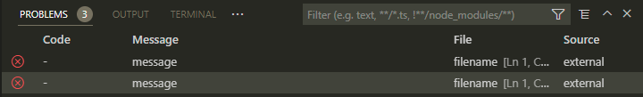

# Reproduction for vscode bug

Vsc is not showing the "code" field of a matched problem properly.

This repo includes a problem matcher that has a simple regex that matches problems in the format of:

```
filename:linenum:col:level:code:message
```

There is a task setup which runs a script that outputs something that should be matched by this regex. When switching to the "Table" view, the code column shows only `-`. For the C++ language extension, it seems to work ok, but for others (including this repro), not so much.



